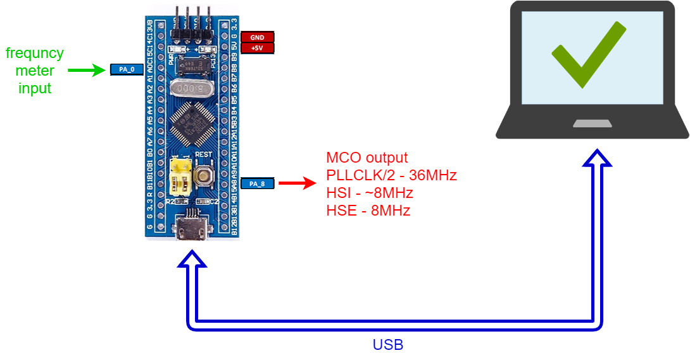
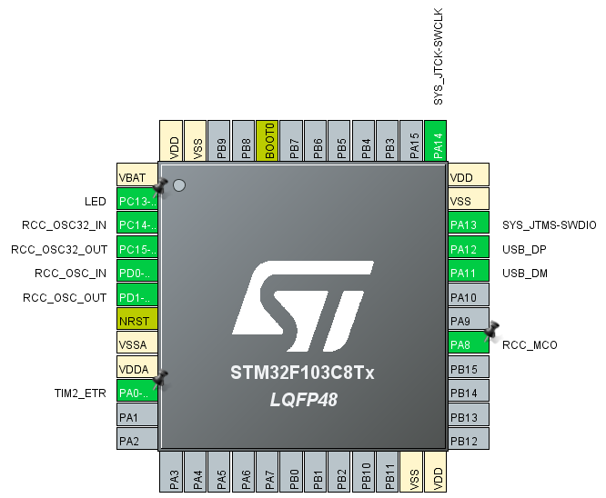

# frequmeter v01
STM32F103C8 - Blue Pill like frequency meter

For this project I've takken pattern from project https://github.com/dword1511/stm32-freqmeter 

This project:
- use STM32CubeMX for configure microprocessor
- use STM32CubeIDE for build (compile)
- USB CDC interface is used for send results to PC
- receive commands via USB CDC, also
- use TIM2 like frequency counter
- measure signal input is pin PA0 - TIM2 ETR input
- TIM2 interrupt is used for increment freq_scratch variable in case of overload
- systick (1kHz) interrupt is used like soft gate

There are possible commands:
- A - turn OFF LED
- D - turn ON LED
- T - toggle LED
- C - clear screen on PC terminal (for example Putty)
- H - hold / unhold last result
- M - change MCO output (pin PA8)

The pinout view from STM32CubeMX:

Pins: PC13 and PC14 - are marked busy.
Project not use LSE clock but on Blue Pill board are connected to crystal ~32kHz.

